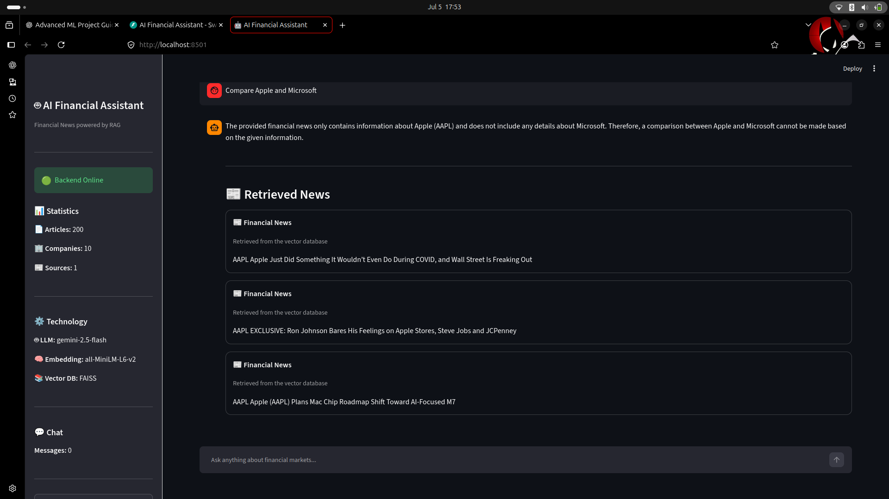
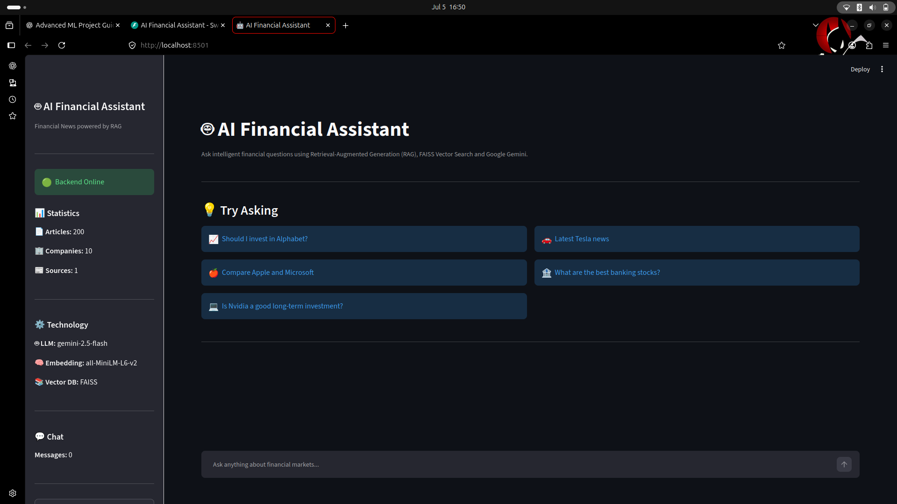
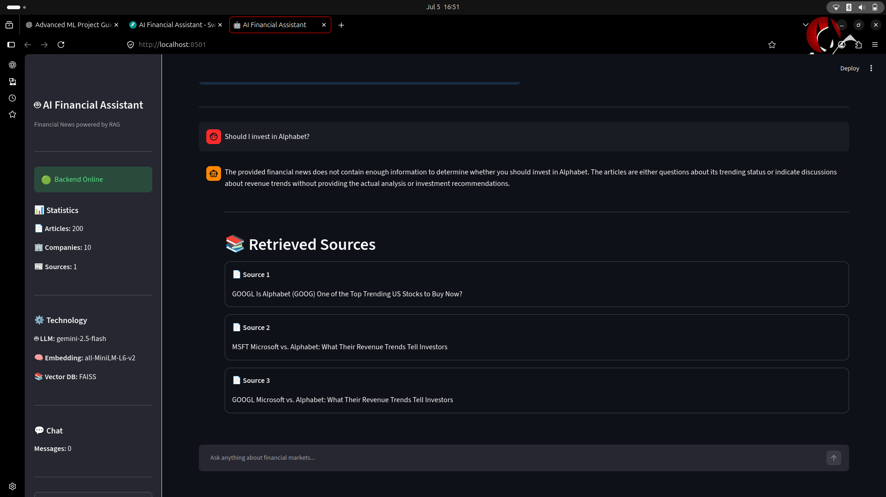

# 🤖 AI Financial Assistant

An AI-powered Financial News Assistant built using **Retrieval-Augmented Generation (RAG)**, **FAISS**, **FastAPI**, **Streamlit**, and **Google Gemini**.

The application retrieves the most relevant financial news articles from a vector database and generates accurate, context-aware responses using Google's Gemini model.

---

## 📸 Application Preview

### 🏠 Home



---

### 💬 Chat Interface



---

### 📰 Retrieved Sources



---

## ✨ Key Features

- 🔍 Retrieval-Augmented Generation (RAG)
- 🤖 Google Gemini Integration
- ⚡ FastAPI Backend
- 🎨 Streamlit Frontend
- 🧠 FAISS Vector Search
- 📚 Source Attribution
- 💬 Conversation History
- 📊 Application Statistics Dashboard
- 📰 Financial News Dataset
- 🏢 Multi-company Financial Analysis


---

# 🏗️ System Architecture

```text
                   +----------------------+
                   |   Streamlit UI       |
                   |  (Frontend Client)   |
                   +----------+-----------+
                              |
                              | HTTP Request
                              v
                   +----------------------+
                   |      FastAPI API     |
                   |   (/ask, /stats)     |
                   +----------+-----------+
                              |
                              |
                              v
                   +----------------------+
                   |     RAG Pipeline      |
                   +----------+-----------+
                              |
          +-------------------+-------------------+
          |                                       |
          v                                       v
+----------------------+              +----------------------+
|   FAISS Vector DB    |              |  Google Gemini LLM   |
| (Semantic Retrieval) |              |  Answer Generation   |
+----------------------+              +----------------------+
                              |
                              v
                    AI Generated Response
```

---

# 📂 Project Structure

```
AI_Financial_Assistant/
│
├── assets/                 # Screenshots for README
├── configs/                # Configuration files
├── data/
│   ├── master/             # Financial news dataset
│   └── embeddings/         # FAISS index & embeddings
│
├── deployment/
├── models/
├── notebooks/
├── src/
│   ├── api/
│   ├── rag/
│   ├── ui/
│   ├── services/
│   ├── agents/
│   └── data_pipeline/
│
├── tests/
├── requirements.txt
└── README.md
```

---

# 🛠️ Tech Stack

| Category | Technology |
|----------|------------|
| Language | Python 3.12 |
| Backend | FastAPI |
| Frontend | Streamlit |
| LLM | Google Gemini 2.5 Flash |
| Embeddings | all-MiniLM-L6-v2 |
| Vector Database | FAISS |
| ML Framework | Sentence Transformers |
| Data Processing | NumPy, JSON |


---

# ⚙️ Installation

## 1. Clone the Repository

```bash
 https://github.com/Ramandeepcod/AI_Financial_Assistant.git

cd AI_Financial_Assistant
```

---

## 2. Create a Virtual Environment

```bash
python -m venv venv

source venv/bin/activate      # Linux / macOS

venv\Scripts\activate         # Windows
```

---

## 3. Install Dependencies

```bash
pip install -r requirements.txt
```

---

## 4. Configure Environment Variables

Create a `.env` file in the project root.

```env
GEMINI_API_KEY=YOUR_GEMINI_API_KEY
```

---

## 5. Start the FastAPI Backend

```bash
python -m uvicorn src.api.main:app --reload
```

Backend:

```
http://localhost:8000
```

Swagger API Documentation:

```
http://localhost:8000/docs
```

---

## 6. Start the Streamlit Frontend

Open another terminal.

```bash
streamlit run src/ui/app.py
```

Application:

```
http://localhost:8501
```

---

# 💬 Example Questions

- Latest Tesla news
- Should I invest in Apple?
- What are the best banking stocks?
- Latest Nvidia news
- Compare Apple and Microsoft *(limited by retrieved context in v1.0)*

---

# 🔌 API Endpoints

| Method | Endpoint | Description |
|---------|----------|-------------|
| POST | `/ask` | Ask financial questions |
| GET | `/stats` | Retrieve application statistics |

---

# 🚀 Future Improvements

- Metadata-aware FAISS retrieval
- Improved comparison queries
- Hybrid semantic + keyword search
- Live stock market data integration
- Financial charts and visualizations
- User authentication
- Watchlist management
- Docker support
- CI/CD with GitHub Actions
- Migration to the new Google GenAI SDK

---

# 👨‍💻 Author

**Ramandeep**

# 👨‍💻 Author

## Ramandeep

B.Tech in Computer Science

Passionate about Artificial Intelligence, Machine Learning, Retrieval-Augmented Generation (RAG), Large Language Models (LLMs), FastAPI and Data Engineering.

### Connect with me

- GitHub: https://github.com/Ramandeepcod
- LinkedIn: https://www.linkedin.com/in/ramandeep18/

---

## ⭐ Support

If you found this project useful, consider giving it a ⭐ on GitHub.